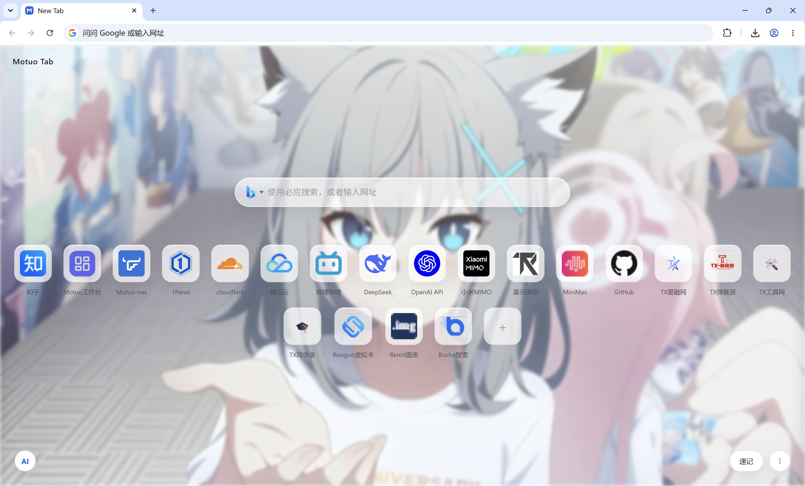
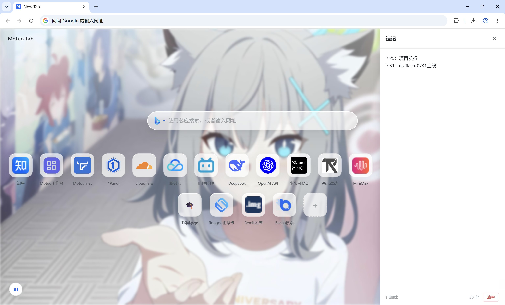
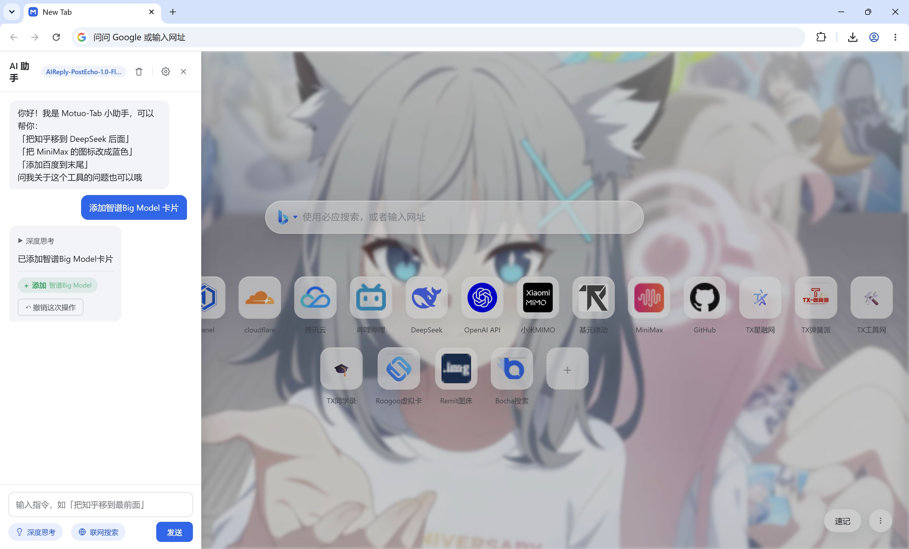

# Motuo-Tab

A browser New Tab replacement page: shortcut management, personalized wallpapers, an AI assistant, and a scratchpad.

[中文](README.md) · [English](README-en.md)

> All data is stored locally in your browser (LocalStorage / IndexedDB) — **no backend required**.
> The extension, single-file, and online versions behave identically: moving the file or using it online works the same.

---

## Features

- **Search**: Baidu / Bing / Google / custom engines (`%s` template); search history, suggestion dropdown, site-direct shortcuts (`zh`/`gh`/`bl`/`tb`/`db`)
- **Shortcuts**: add / edit / delete, drag-to-sort, drag-to-bottom-to-delete, context menu, automatic favicon fetching
- **Personalization**: image / solid-color wallpaper, blur amount, card opacity (image / text toggles independently)
- **AI assistant**: OpenAI-compatible streaming chat, deep thinking, web search (Bocha AI), manage cards in natural language with one-click undo
- **Scratchpad**: quick notes, auto-saved
- **Export / Import**: full backup (shortcuts + wallpaper + AI config & history + personalization)

## Screenshots

Home (wallpaper + search + shortcuts):



| Scratchpad | AI Assistant |
|------------|--------------|
|  |  |

## Installation

Currently supports Chromium-based browsers (Chrome / Edge, etc.). Firefox users can use the "Single-file HTML" method; to point the new tab directly at a local file, see the AutoConfig tutorial below.

### Release download (recommended)

Download the latest extension package from [Releases](../../releases), unzip it, and install in Chrome / Edge:

1. Open `chrome://extensions` (Edge: `edge://extensions`)
2. Enable "Developer mode" in the top-right corner
3. Click "Load unpacked" and select the unzipped `extension` folder

New tabs will now show Motuo-Tab.

> ⚠️ **Keep the unzipped `extension` folder safe — it IS the extension.**
> "Load unpacked" does not copy files into the browser; the browser only references
> this folder. Deleting, moving, or renaming it will break the extension.
> Unzip it to a long-term, fixed location (e.g. `D:\Motuo-Tab\`).

**Updating & data safety**:

- To update: unzip the new version **over the same path** (keep the folder's absolute path unchanged), then click the reload icon on the extension card — no reinstall needed;
- Your data (shortcuts, AI config & history, etc.) lives in the browser's local storage, bound to the extension ID. For unpacked extensions the ID is derived from the folder's **absolute path** — once the path changes, the browser treats it as a brand-new extension and old data becomes unreachable. So never move or delete the folder.

### Single-file HTML (no installation)

Download the single-file `newtab.html` from [Releases](../../releases) and double-click to use it. You can also set it as your new tab page:

- Edge: Settings → On startup → Open specific pages → add the file
- Chrome: needs an extension such as "New Tab Redirect" pointing to the file
- Other browsers (e.g. Firefox): just use the single file

### Firefox: Point the new tab to a local HTML via AutoConfig

Firefox does not allow pointing the new tab page at a local `file://` path and has no built-in setting for it. Using Mozilla's official **AutoConfig** mechanism (written into the Firefox install directory, bypassing extension caching) is currently the only way to point the new tab directly at a local `file://` path. The following applies to Firefox 136 and later.

**Step 1: open the `defaults/pref/` folder inside the Firefox install directory**

- Windows: `C:\Program Files\Mozilla Firefox\defaults\pref`
- macOS: `/Applications/Firefox.app/Contents/Resources/defaults/pref/` (adjust to your actual system path)
- Linux: `/opt/firefox/defaults/pref/`

Create `autoconfig.js` with:

```ini
pref("general.config.filename", "mozilla.cfg");
pref("general.config.obscure_value", 0);
pref("general.config.sandbox_enabled", false);
```

**Step 2: go back to the Firefox install root (the parent of `defaults`) and create `mozilla.cfg`**

The first line must be a comment (a hard requirement of Firefox, otherwise the whole file is ignored):

```js
// My new tab
try {
  const ff = {};
  ChromeUtils.defineESModuleGetters(ff, {
    AboutNewTab: "resource:///modules/AboutNewTab.sys.mjs"
  });
  ff.AboutNewTab.newTabURL = 'file:///C:/path/to/your/index.html';
} catch (e) {
  ChromeUtils.reportError(e);
}
```

Replace `file:///C:/path/to/your/index.html` with the real absolute path of your local HTML (same on Linux/macOS, e.g. `file:///home/you/index.html`).

**Step 3: restart Firefox and press `Ctrl+T`** to verify the new tab now points to the file.

### Online preview / use

Visit [https://xr24.cn/motuo-tab-online/](https://xr24.cn/motuo-tab-online/) directly — no installation needed. Data still stays in your local browser (LocalStorage).

### Manual build (for developers)

```bash
npm install
npm run build
```

Artifacts: `dist/newtab.html` (single-file) and `dist/extension` (MV3 extension).

## Usage

### Keyboard shortcuts

| Shortcut | Action |
|----------|--------|
| `Ctrl+E` | Focus mode (content fades out, search box centers) |
| `Ctrl+K` | Edit mode (drag to sort / drag to bottom to delete) |
| `Ctrl+A` | Open AI assistant |
| `Esc` | Close modals / menus |

### Site-direct search

Type "prefix + space + keyword" in the search box to search directly on a site:

| Prefix | Site |
|--------|------|
| `zh` | Zhihu |
| `gh` | GitHub |
| `bl` | Bilibili |
| `tb` | Taobao |
| `db` | Douban |

Example: `bl Node.js` → search Node.js on Bilibili.

### AI assistant

1. Click the `AI` button in the bottom-left corner to open the panel
2. Click `⚙` in the top-right to configure: API endpoint, key, model (OpenAI-compatible, e.g. DeepSeek)
3. Optional: enable "Web search" with a Bocha AI key; enable "Deep thinking" for model reasoning

Manage cards in natural language, e.g. "make GitHub green" or "move Zhihu to the front"; every operation can be undone.

### Data

- Export / Import: bottom-right menu → General settings, exports a full JSON backup
- All data stays local: `localStorage` (settings, shortcuts, AI history) and `IndexedDB` (image wallpaper); the full key list is documented in the header comment of `src/index.html`

## Development

```bash
npm install        # install dependencies
npm run build      # build artifacts to dist/ (single-file + extension)
npm test           # run tests (requires build first)
npm run gen:icons  # regenerate extension icons
```

## Directory structure

```
src/                  # source code
  index.html          # page template (external CSS/JS)
  styles/main.css     # styles
  scripts/search.js   # search module
  scripts/main.js     # main module (cards/wallpaper/AI/scratchpad/import-export)
  scripts/idle.js     # idle-hide UI module
  favicon.ico
scripts/              # build tooling
  build.js            # single-file + MV3 extension
  split-source.js     # legacy single-file → src/ migration tool
  gen-icons.js        # generate extension icons
tests/                # jsdom regression tests
dist/                 # build output (gitignored)
```

## GitHub Actions

| Workflow | Trigger | Purpose |
|----------|---------|---------|
| `ci.yml` | push / PR | build + test |
| `release.yml` | tag `v*` | publish Release (newtab.html + extension zip) |

Release: `git tag v1.0.0 && git push origin v1.0.0`.

## License

[MIT](LICENSE) © 2026 Motuo24
