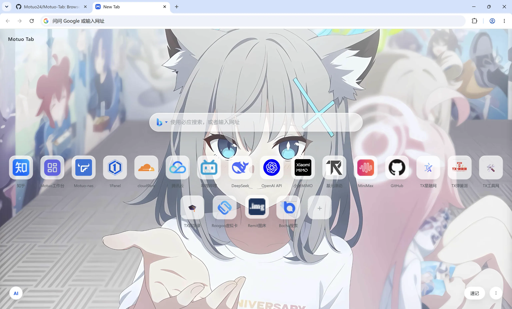
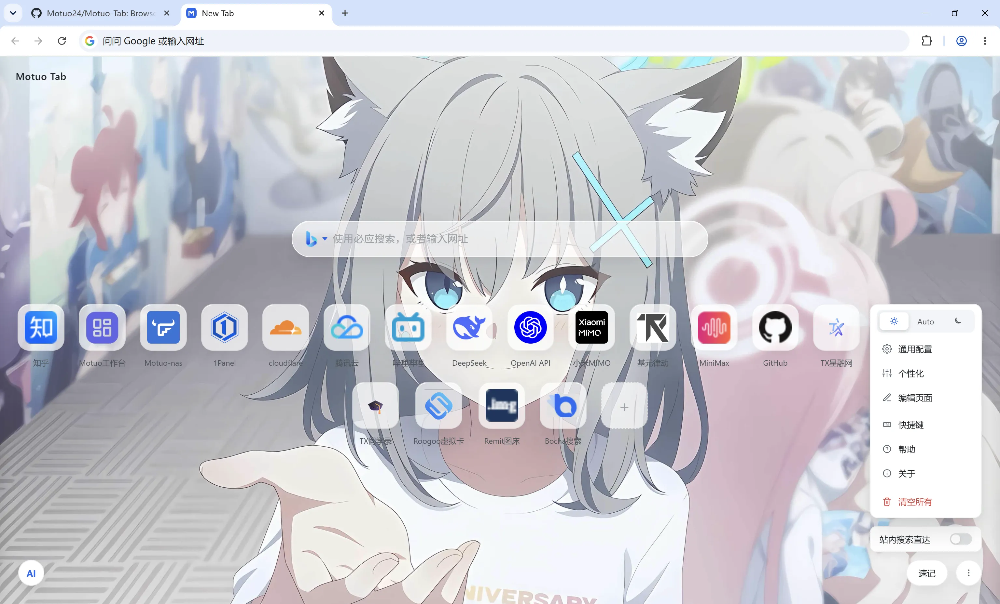
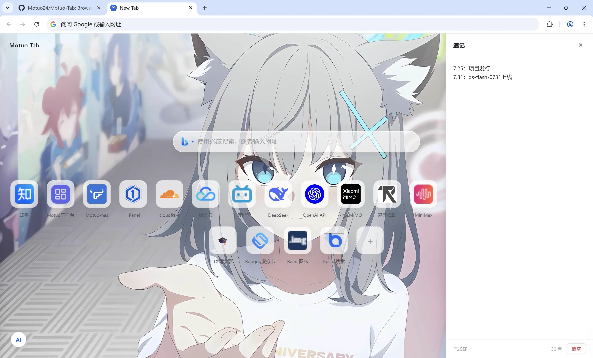

# Motuo-Tab

浏览器新标签页（New Tab）替换页：快捷方式管理、个性化壁纸、AI 助手、速记本。

[中文](README.md) · [English](README-en.md)

> 数据全部保存在浏览器本地（LocalStorage / IndexedDB），**不依赖任何后端**。
> 无论使用扩展版、本地单文件版还是在线版，功能完全一致：更换文件位置、或直接在线使用，均正常工作。

***

## 更新记录（v0.8.2）

- **主题模式**：新增浅色 / 深色 / 自动三种模式切换；自动模式文字颜色随壁纸像素实时反色

- **帮助中心**：菜单新增「帮助」入口，左侧章节导航 + 右侧内容的 Markdown 式排版，含 AI 密钥 / 博查搜索配置与快捷键教程

- **快捷键弹窗**：重建视觉样式（键帽拆分、由少到多排序、描述文字柔和化）并补齐 Command 等价键

- **菜单重构**：菜单项图标化、功能分组、危险操作隔离，站内搜索直达药丸卡片化

- **交互优化**：弹窗打开时点击右下角菜单按钮可直接关闭返回；修复弹窗遮罩遮挡菜单按钮的问题

- **默认快捷方式**：更新内置默认快捷方式（含图片图标）

- **AI 助手**：侧边栏标题改为品牌图标

***

## 功能

- **搜索**：百度 / 必应 / 谷歌 / 自定义引擎（`%s` 模板）；搜索历史、建议下拉、站内直达（`zh`/`gh`/`bl`/`tb`/`db`）

- **快捷方式**：增删改、拖拽排序、拖到底部删除、右键菜单、自动抓取 favicon

- **个性化**：图片 / 纯色壁纸、模糊度、卡片透明度（图标 / 文字独立开关）

- **AI 助手**：OpenAI 兼容接口流式对话，深度思考、联网搜索（博查 AI），自然语言管理卡片并一键撤销

- **速记本**：随手记录，自动保存

- **导出 / 导入**：完整备份（快捷方式 + 壁纸 + AI 配置与历史 + 个性化配置）

## 预览

主页（壁纸 + 搜索 + 快捷方式）：

| 主页                                      | 菜单                                      |
| --------------------------------------- | --------------------------------------- |
|  |  |

| 速记本                                            | AI 助手                                    |
| ---------------------------------------------- | ---------------------------------------- |
|  |  |

## 安装

目前仅支持 Chromium 内核浏览器（Chrome / Edge 等）。Firefox 用户请用「单文件 HTML」；如需把新标签页直接指向本地文件，见下方 AutoConfig 教程。

### 发行版下载（推荐）

从 [Releases](../../releases) 下载最新版扩展压缩包，解压后在 Chrome / Edge 中安装：

1. 打开 `chrome://extensions`（Edge 用 `edge://extensions`）
2. 开启右上角「开发者模式」
3. 点「加载已解压的扩展程序」，选择解压后的 `extension` 文件夹

之后新开标签页即是 Motuo-Tab。

> ⚠️ **请妥善保管解压出来的** **`extension`** **文件夹，它就是扩展本体。**
> 「加载已解压的扩展程序」不会把文件复制进浏览器，浏览器只是引用这个文件夹；
> 删除、移动或重命名它都会让扩展失效。建议解压到一个长期固定的位置（如 `D:\Motuo-Tab\`）。

**更新与数据安全**：

- 更新版本：把新版解压**覆盖到同一路径**（保持文件夹的绝对路径不变），再到扩展管理页点一下「刷新」即可，无需重装；

- 数据（快捷方式、AI 配置与历史等）保存在浏览器本地存储中，与扩展 ID 绑定；而「未打包扩展」的 ID 由文件夹的**绝对路径**决定——路径一变，浏览器会视为一个全新的扩展，旧数据将无法读取。因此请勿更改文件夹位置，更不要删除它。

### 单文件 HTML（免安装）

从 [Releases](../../releases) 下载单文件版 `newtab.html`，双击打开即用；也可设为浏览器新标签页：

- Edge：设置 → 启动时 → 打开特定页面 → 添加该文件

- Chrome：配合「New Tab Redirect」等扩展指向该文件

- 其他浏览器（如 Firefox）：直接用单文件即可

### Firefox：AutoConfig 设置新标签页指向本地 HTML

Firefox 默认不允许把新标签页指向本地 `file://` 路径，且无内置设置项。通过 Mozilla 官方的 **AutoConfig** 机制（写在 Firefox 安装目录里，不经过扩展缓存），是目前唯一能直接让新标签页指向本地 `file://` 路径的办法。以下针对 Firefox 136 及以上版本。

**第一步：进入 Firefox 安装目录下的** **`defaults/pref/`** **文件夹**

- Windows：`C:\Program Files\Mozilla Firefox\defaults\pref`

- macOS：`/Applications/Firefox.app/Contents/Resources/defaults/pref/`（按你系统实际情况）

- Linux：`/opt/firefox/defaults/pref/`

新建文件 `autoconfig.js`，内容：

```ini
pref("general.config.filename", "mozilla.cfg");
pref("general.config.obscure_value", 0);
pref("general.config.sandbox_enabled", false);
```

**第二步：回到 Firefox 安装根目录（即** **`defaults`** **的上一级），新建** **`mozilla.cfg`**

第一行必须是一行注释（这是 Firefox 的硬性要求，否则整个文件会被忽略）：

```js
// My new tab
try {
  const ff = {};
  ChromeUtils.defineESModuleGetters(ff, {
    AboutNewTab: "resource:///modules/AboutNewTab.sys.mjs"
  });
  ff.AboutNewTab.newTabURL = 'file:///C:/path/to/your/index.html';
} catch (e) {
  ChromeUtils.reportError(e);
}
```

把 `file:///C:/path/to/your/index.html` 换成本地 HTML 的真实绝对路径（Linux/macOS 同理，写成 `file:///home/you/index.html` 这类格式）。

**第三步：重启 Firefox，按** **`Ctrl+T`** **验证**新标签页已指向该文件。

### 在线使用 / 预览

直接访问 <https://xr24.cn/motuo-tab-online/> 即可使用，无需下载安装；数据仍存于本机浏览器（LocalStorage）。

### 手动构建（开发者）

```bash
npm install
npm run build
```

产物：`dist/newtab.html`（单文件）与 `dist/extension`（MV3 扩展目录）。

## 使用

### 快捷键

| 快捷键      | 作用                  |
| -------- | ------------------- |
| `Ctrl+E` | 专注模式（内容淡出、搜索框居中）    |
| `Ctrl+K` | 编辑模式（拖拽排序 / 拖到底部删除） |
| `Ctrl+A` | 打开 AI 助手            |
| `Esc`    | 关闭弹窗 / 菜单           |

### 站内搜索直达

搜索框输入「前缀 + 空格 + 关键词」，直接跳到对应站点搜索：

| 前缀   | 站点     |
| ---- | ------ |
| `zh` | 知乎     |
| `gh` | GitHub |
| `bl` | B站     |
| `tb` | 淘宝     |
| `db` | 豆瓣     |

例：`bl Node.js` → 在 B 站搜索 Node.js。

### AI 助手

1. 点左下角 `AI` 按钮打开面板
2. 点右上角 `⚙` 配置：API 地址、Key、模型（兼容 OpenAI 协议，如 DeepSeek）
3. 可选：「联网搜索」需填入博查 AI 密钥；「深度思考」启用模型推理

支持自然语言操作卡片，例如「把 GitHub 改成绿色」「把知乎移到最前面」，操作后可一键撤销。

### 数据

- 导出 / 导入：右下角菜单 → 通用配置，导出完整 JSON 备份

- 数据全部存本地：`localStorage`（配置、快捷方式、AI 历史）与 `IndexedDB`（图片壁纸）；完整键位清单见 `src/index.html` 头部注释

## 开发

```bash
npm install        # 安装依赖
npm run build      # 构建产物到 dist/（单文件 + 扩展目录）
npm test           # 运行测试（需先 build）
npm run gen:icons  # 重新生成扩展图标
```

## 目录结构

```
src/                  # 源码
  index.html          # 页面模板（外链 CSS/JS）
  styles/main.css     # 样式
  scripts/search.js   # 搜索模块
  scripts/main.js     # 主模块（卡片/壁纸/AI/速记/导入导出）
  scripts/idle.js     # Idle 隐藏 UI
  favicon.ico
scripts/              # 构建工具
  build.js            # 单文件 + MV3 扩展
  split-source.js     # 旧单文件 → src/ 迁移工具
  gen-icons.js        # 生成扩展图标
tests/                # jsdom 回归测试
dist/                 # 构建产物（gitignore）
```

## 许可证

[MIT](LICENSE) © 2026 Motuo24
